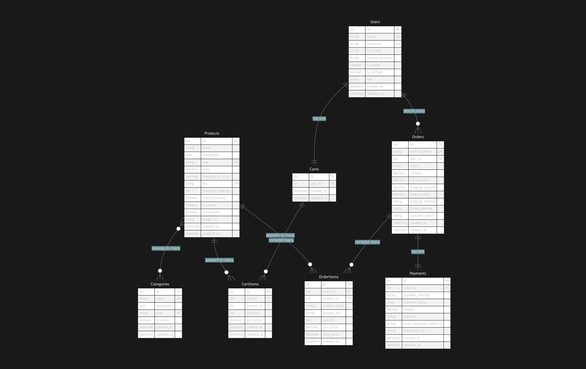

# ecom-api

my ready to use ecommerce api for python (fast api + postgres) ecom jobs

# ecom-api

i want this to be my go to ecomerce api for python, so i will be using fast api because it has a good documentation generation method and also i can monitor the api design myself. also, i will use postgresql to make sure i haev strong data consistency. already have sqlalchemy running as always. or honestly, i just prefer postgresql and sqlalchemy.

db design:
